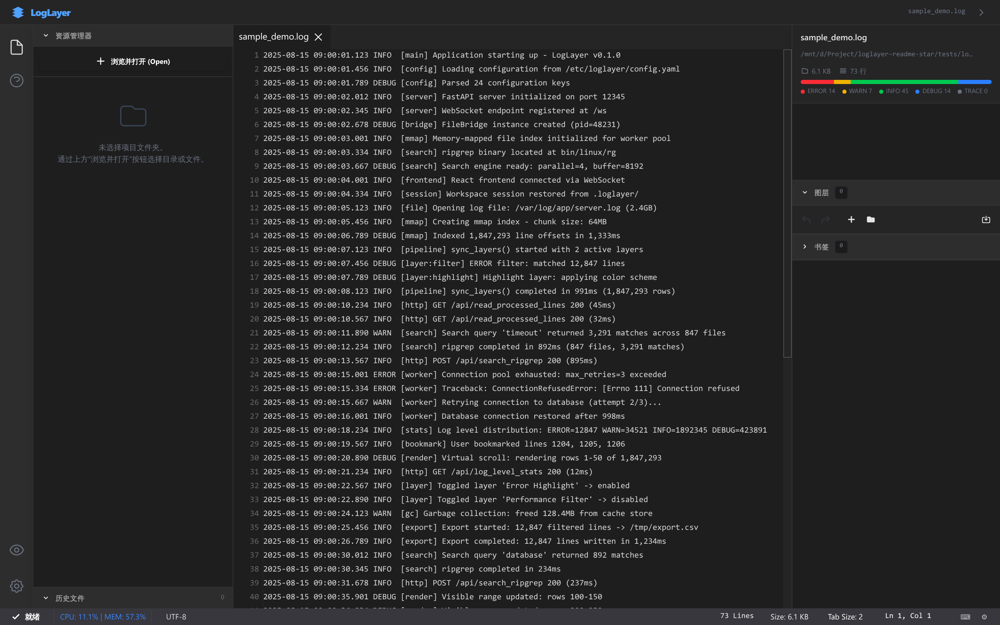
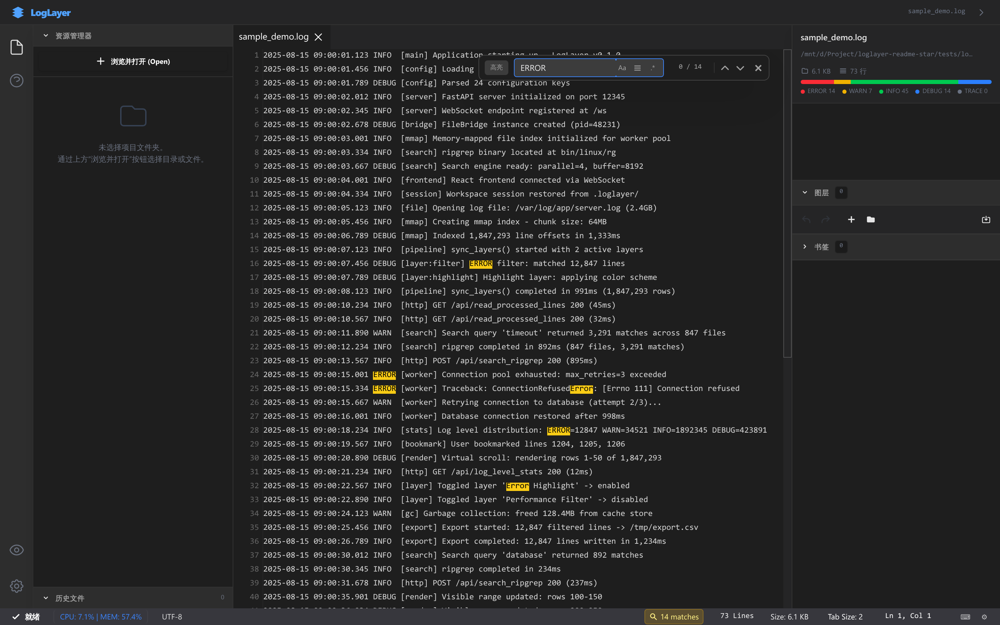
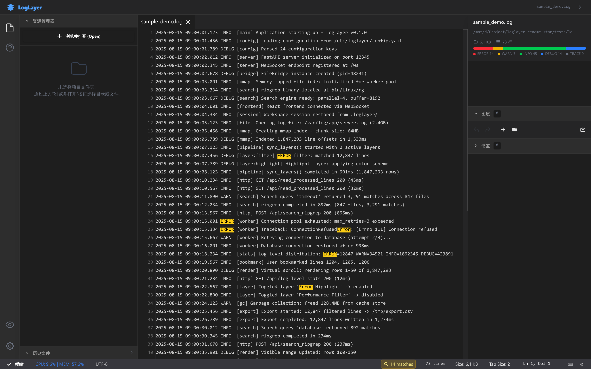
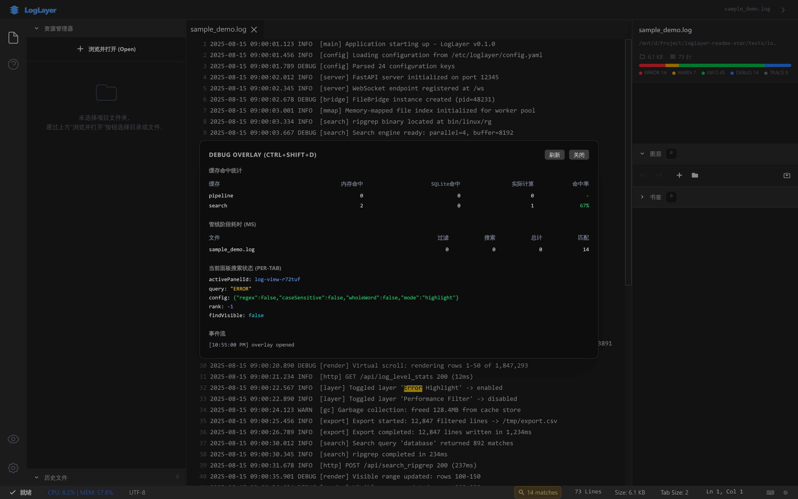

# LogLayer

<p align="center">
  <strong>Open a 1GB log file in seconds.</strong><br>
  Log analysis, with the power of layers.
</p>

<p align="center">
  <a href="https://github.com/qmjianda/loglayer/actions/workflows/ci.yml"></a>
  <a href="https://github.com/qmjianda/loglayer/blob/main/LICENSE"></a>
  <a href="https://github.com/qmjianda/loglayer/releases"></a>
  <a href="https://github.com/qmjianda/loglayer"></a>
</p>

<p align="center">
  <a href="#english">English</a> · <a href="#chinese">中文</a>
</p>



LogLayer is a desktop-class log viewer and analysis tool for developers, SREs, and anyone who has outgrown opening huge log files in a text editor. It combines `mmap` indexing, virtualized rendering, ripgrep search, and composable log layers in a focused local application.

<a name="english"></a>
## English

### Why LogLayer?

- **Built for huge files**: Index and navigate GB-scale logs without loading every line into the DOM.
- **Layer-based analysis**: Compose FILTER and HIGHLIGHT layers to isolate incidents and make patterns visible.
- **Fast native search**: Use the bundled `ripgrep` engine for responsive full-text search across large files.
- **Desktop workflow, browser-compatible core**: FastAPI and WebSockets power a local app that can also run in a browser.
- **Persistent workspaces**: Reopen files, tabs, bookmarks, and layer settings from `.loglayer/`.
- **Offline packaging**: Build portable Windows and Linux bundles with the included packaging tool.

### Screenshots

| Log viewer | Search and highlight |
| --- | --- |
|  |  |

| Layers panel | Diagnostics overlay |
| --- | --- |
|  |  |

> A short demo GIF is planned for the next documentation update. The intended flow is: open a 1GB+ log, scroll, search `ERROR`, then apply a layer.

### Quick Start

#### Option 1: Docker

Docker support is provided for browser-based local use. Build the image and mount the directory containing logs:

```bash
docker build -t loglayer .
docker run --rm -p 12345:12345 -v "$PWD:/workspace" loglayer
```

Open <http://127.0.0.1:12345>. Docker validation is environment-dependent; the image is intended for a host with Docker Desktop or a Linux Docker engine enabled.

#### Option 2: Release package

Once published, download the portable package from [GitHub Releases](https://github.com/qmjianda/loglayer/releases). Release artifacts are intended to run without a development environment.

#### Option 3: Build from source

Requirements: Node.js 18+ and Python 3.10+.

```bash
git clone https://github.com/qmjianda/loglayer.git
cd loglayer
npm ci
python -m pip install -r requirements.txt
```

Start the backend and frontend in separate terminals:

```bash
python backend/main.py --no-ui
npm run dev
```

Open <http://127.0.0.1:3000>. For a production-style local bundle:

```bash
npm run build
rm -rf backend/www
cp -r dist backend/www
python backend/main.py --no-ui
```

Create a portable source bundle with `python tools/package_offline.py`; the output is written to `dist_offline/`.

### Benchmarks

The committed [benchmark report](docs/BENCHMARKS.md) separates reproducible indexing/search measurements from the heavier end-to-end phase gate. The current local baseline was measured against a 1.3GB log fixture on Linux:

| Operation | Result |
| --- | ---: |
| Threaded mmap line indexing | 4.265 s |
| `re.finditer` line indexing | 2.746 s |
| `ripgrep` search for `ERROR` | 1.015 s |

These are reference measurements, not a promise for every machine. A lightweight benchmark guard runs in CI to catch order-of-magnitude regressions; the full 1.3GB phase gate remains a manual release check.

### How It Compares

| Capability | LogLayer | lnav | GoAccess | Text editor |
| --- | :---: | :---: | :---: | :---: |
| GB-scale indexed navigation | Yes | Partial | No | No |
| Virtualized log rendering | Yes | Terminal UI | No | No |
| Composable visual layers | Yes | No | No | No |
| Native full-text search | ripgrep | Built-in | Access-log focused | Varies |
| Workspace persistence | Yes | Session-based | No | Varies |
| Local desktop/browser workflow | Yes | Terminal | Web report | Yes |

### Tech Stack

- **Backend**: Python 3.10+, FastAPI, Uvicorn, WebSockets, `mmap`, ripgrep
- **Frontend**: React 19, TypeScript, Vite, Tailwind CSS 4, react-virtuoso

### Roadmap

- Improve one-click release downloads for Windows and Linux
- Expand the layer library and layer authoring guide
- Continue performance regression coverage for indexing, search, and scrolling

### Contributing

Issues and pull requests are welcome. Before opening a performance-related issue, include the file size, line count, operating system, and the command or workflow used to reproduce it.

LogLayer is released under the [MIT License](LICENSE).

---

<a name="chinese"></a>
## 中文

LogLayer 是一款面向开发者、SRE 和运维工程师的桌面级日志查看与分析工具，适合处理已经超出普通文本编辑器能力范围的超大日志文件。它将 `mmap` 索引、虚拟化渲染、ripgrep 搜索和可组合日志图层整合到一个专注的本地应用中。

### 为什么是 LogLayer？

- **为超大日志而生**：使用索引和虚拟化渲染浏览 GB 级日志，不把所有行塞进 DOM。
- **图层化分析**：组合 FILTER 与 HIGHLIGHT 图层，快速隔离故障并突出关键模式。
- **高速原生搜索**：集成随应用发布的 `ripgrep`，在大文件中保持响应速度。
- **桌面体验，浏览器兼容核心**：由 FastAPI 与 WebSocket 驱动，也可以直接在浏览器中访问本地服务。
- **工作区持久化**：从 `.loglayer/` 恢复文件、标签页、书签和图层配置。
- **离线打包**：使用内置打包工具生成 Windows 与 Linux 便携版本。

### 截图

| 日志查看器 | 搜索与高亮 |
| --- | --- |
|  |  |

| 图层面板 | 诊断浮层 |
| --- | --- |
|  |  |

> 下一版文档计划加入短 GIF，演示完整流程：打开 1GB 以上日志、滚动、搜索 `ERROR`，再应用图层。

### 快速开始

#### 方式一：Docker

Docker 模式用于本地浏览器访问。构建镜像并挂载包含日志的目录：

```bash
docker build -t loglayer .
docker run --rm -p 12345:12345 -v "$PWD:/workspace" loglayer
```

然后打开 <http://127.0.0.1:12345>。Docker 的实际运行结果取决于宿主环境，需要启用 Docker Desktop 或 Linux Docker 引擎。

#### 方式二：Release 发布包

发布后可从 [GitHub Releases](https://github.com/qmjianda/loglayer/releases) 下载便携包，目标是无需开发环境即可运行。

#### 方式三：源码运行

环境要求：Node.js 18+、Python 3.10+。

```bash
git clone https://github.com/qmjianda/loglayer.git
cd loglayer
npm ci
python -m pip install -r requirements.txt
```

在两个终端分别启动后端和前端：

```bash
python backend/main.py --no-ui
npm run dev
```

打开 <http://127.0.0.1:3000>。如果需要本地生产式静态包：

```bash
npm run build
rm -rf backend/www
cp -r dist backend/www
python backend/main.py --no-ui
```

使用 `python tools/package_offline.py` 可生成便携源码包，输出目录为 `dist_offline/`。

### 性能基准

提交到仓库的[基准报告](docs/BENCHMARKS.md)将可复现的索引/搜索数据与更重的端到端门禁分开记录。当前 Linux 环境使用 1.3GB 日志文件测得：

| 操作 | 结果 |
| --- | ---: |
| 多线程 mmap 行索引 | 4.265 秒 |
| `re.finditer` 行索引 | 2.746 秒 |
| 使用 `ripgrep` 搜索 `ERROR` | 1.015 秒 |

这些是参考环境数据，不代表所有机器都能达到相同结果。CI 会运行轻量基准，捕获数量级性能回退；完整 1.3GB 门禁保留为发布前手动检查。

### 与其他工具对比

| 能力 | LogLayer | lnav | GoAccess | 文本编辑器 |
| --- | :---: | :---: | :---: | :---: |
| GB 级索引导航 | 有 | 部分支持 | 无 | 无 |
| 虚拟化日志渲染 | 有 | 终端界面 | 无 | 无 |
| 可组合视觉图层 | 有 | 无 | 无 | 无 |
| 原生全文搜索 | ripgrep | 内置 | 面向访问日志 | 视工具而定 |
| 工作区持久化 | 有 | 会话级 | 无 | 视工具而定 |
| 本地桌面/浏览器工作流 | 有 | 终端 | Web 报告 | 有 |

### 技术栈

- **后端**：Python 3.10+、FastAPI、Uvicorn、WebSocket、`mmap`、ripgrep
- **前端**：React 19、TypeScript、Vite、Tailwind CSS 4、react-virtuoso

### 路线图

- 完善 Windows 与 Linux 一键 Release 下载
- 扩充图层库和图层开发指南
- 持续覆盖索引、搜索、滚动性能回归

### 参与贡献

欢迎提交 Issue 和 Pull Request。提交性能问题时，请附上文件大小、行数、操作系统，以及复现所用的命令或操作流程。

LogLayer 使用 [MIT License](LICENSE) 发布。
