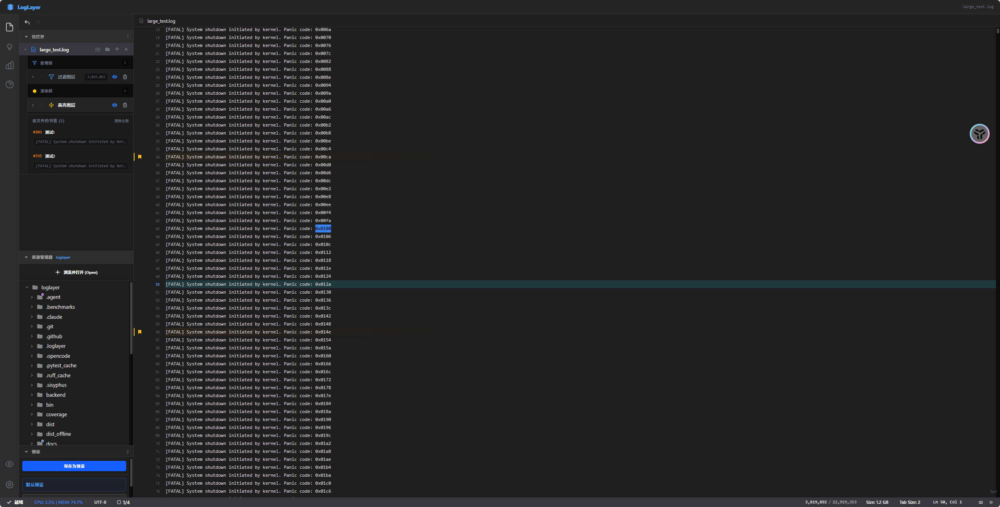

# LogLayer

[English](#english) | [中文](#chinese)

---

<a name="english"></a>
## English

LogLayer is a high-performance log analysis tool for massive log files (1GB+). It combines Python's system-level power with a modern React frontend, providing a desktop-class experience.



### Key Features

- 🤖 **AI-Powered Analysis**: Intelligent log analysis with OpenAI/Ollama integration
- ⚡ **Lightning-Fast**: mmap + multi-threaded indexing for 1GB+ logs in seconds
- 🎯 **Virtual Scrolling**: O(1) rendering, 60FPS at millions of lines
- 🔍 **Native Search**: ripgrep integration for instant full-text search
- 🎨 **Layer System**: Real-time FILTER/HIGHLIGHT layers
- 💾 **Session Persistence**: Auto-save workspace to `.loglayer/`
- 📦 **One-Click Packaging**: Standalone EXE for Windows/Linux

### Quick Start

```bash
# Clone
git clone https://github.com/qmjianda/loglayout.git
cd loglayer

# Install
npm install
pip install fastapi uvicorn websockets pywebview

# Run
cd frontend && npm run dev
python backend/main.py
```

### Documentation

- [Development Guide](docs/INDEX.md)
- [Architecture](docs/PROJECT_MAP.md)
- [Deployment](docs/guides/DEPLOY.md)

---

<a name="chinese"></a>
## 中文

LogLayer 是一款高性能日志分析工具，专为海量日志文件（1GB+）设计。它结合了 Python 的系统级能力与现代化 React 前端，提供原生桌面体验。


### 核心特性

- 🤖 **AI 智能分析**: 集成 OpenAI/Ollama 的智能日志分析
- ⚡ **极速索引**: mmap + 多线程，秒开 GB 级日志
- 🎯 **虚拟滚动**: O(1) 渲染，百万行 60FPS
- 🔍 **原生搜索**: ripgrep 集成，瞬间全文检索
- 🎨 **图层系统**: 实时 FILTER/HIGHLIGHT 图层
- 💾 **会话持久**: 自动保存工作区到 `.loglayer/`
- 📦 **一键打包**: Windows/Linux 独立可执行程序

### 快速开始

```bash
# 克隆
git clone https://github.com/qmjianda/loglayout.git
cd loglayer

# 安装
npm install
pip install fastapi uvicorn websockets pywebview

# 运行
cd frontend && npm run dev
python backend/main.py
```

### 文档

- [开发指南](docs/INDEX.md)
- [架构设计](docs/PROJECT_MAP.md)
- [部署说明](docs/guides/DEPLOY.md)

---

## Tech Stack

**Backend**: Python 3.10+ | FastAPI | uvicorn | WebSockets | mmap | ripgrep
**Frontend**: React 19 | TypeScript | Vite | Tailwind CSS 4 | Canvas
**Desktop**: pywebview (cross-platform native window)

---

*高性能日志分析，从这里开始。*
