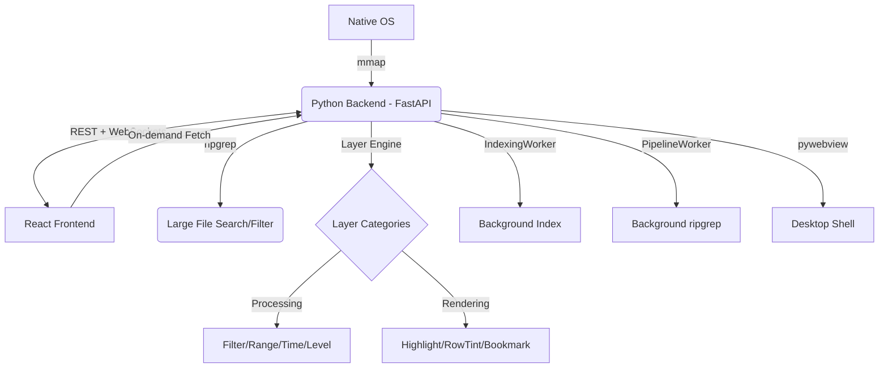

# LogLayer: Project Map

> 架构地图和模块拓扑

---

## 1. System Architecture

---

## 2. Module Topology

| Module | Location | Responsibility | Dependencies |
|:---|:---|:---|:---|
| **Backend Core** | `backend/bridge.py` | Orchestration, Signal handling, File indexing | `mmap`, `fastapi`, `websockets` |
| **Unified Logic** | `backend/loglayer/` | Layer Engine, UI Schema, Built-in layers | `re`, `inspect` |
| **API Server** | `backend/main.py` | FastAPI app, REST/WS routes, pywebview | `fastapi`, `uvicorn` |
| **Bridge Client** | `frontend/src/bridge_client.ts` | Frontend API, WebSocket client | `fetch`, `WebSocket` |
| **Dynamic UI** | `frontend/src/components/DynamicUI/` | Schema-driven config UI | `types.ts` |
| **Log Viewer** | `frontend/src/components/LogViewer.tsx` | Canvas rendering, virtual scroll | `bridge_client.ts` |
| **State Orchestration** | `frontend/src/App.tsx` | Global state, UI layout, hooks | All Components |
| **Tests & Logs** | `tests/` | Unit tests, scale tests | `pytest` |
| **Dev Tools** | `tools/` | Build and packaging scripts | `PyInstaller`, `npm` |

---

## 3. Core Features

- [x] **Large File Loading**: 1GB+ indexing via `mmap` offsets
- [x] **Virtual Scrolling**: Viewport-only O(1) memory rendering
- [x] **Fast Search**: Native `ripgrep` integration
- [x] **Native Interop**: Drag & drop, native file dialogs
- [x] **Platform-aware**: Backend-driven OS detection
- [x] **Layer Pipeline**: Python-side filtering/highlighting
- [x] **Browser Compatible**: Dialog fallbacks for browser mode

---

## 4. Coupling Notes

- **Communication Contract**: `main.py` WebSocket messages must match `bridge_client.ts` signal emitters
- **Virtualization Sync**: `LogViewer` viewport depends on `read_processed_lines` REST endpoint
- **Layer Sync**: Frontend calls `sync_layers()` (processing) or `sync_decorations()` (rendering)
- **Platform Info**: `usePlatformInfo` hook depends on `/api/platform` endpoint

---

> 变更历史见 `openspec/changes/` 目录

*2026-03-14*
