# LogLayer 系统架构全景图

> 本文档使用 Mermaid 图表清晰描述 LogLayer 项目的完整架构，帮助首次接触代码的开发者快速理解系统结构。
> **注意**: 本文档已更新以反映 OOP 重构后的新架构（2026-03）

---

## 目录

1. [系统总览](#1-系统总览)
2. [技术栈分层](#2-技术栈分层)
3. [后端架构](#3-后端架构)
4. [前端架构](#4-前端架构)
5. [图层系统核心](#5-图层系统核心)
6. [数据流与交互](#6-数据流与交互)
7. [类型同步机制](#7-类型同步机制)
8. [模块交互总览](#8-模块交互总览)

---

## 1. 系统总览

### 1.1 产品定位

**LogLayer** - 高性能日志分析桌面应用，支持 GB 级日志文件的毫秒级搜索和可视化过滤。

| 维度 | 描述 |
|:-----|:-----|
| **产品形态** | 桌面应用 (pywebview + FastAPI) |
| **目标用户** | 开发工程师、运维人员、SRE |
| **核心场景** | 大型日志文件分析、错误追踪、性能优化 |
| **竞争优势** | mmap 索引、Canvas 虚拟滚动、多引擎搜索 |

### 1.2 系统架构总览图

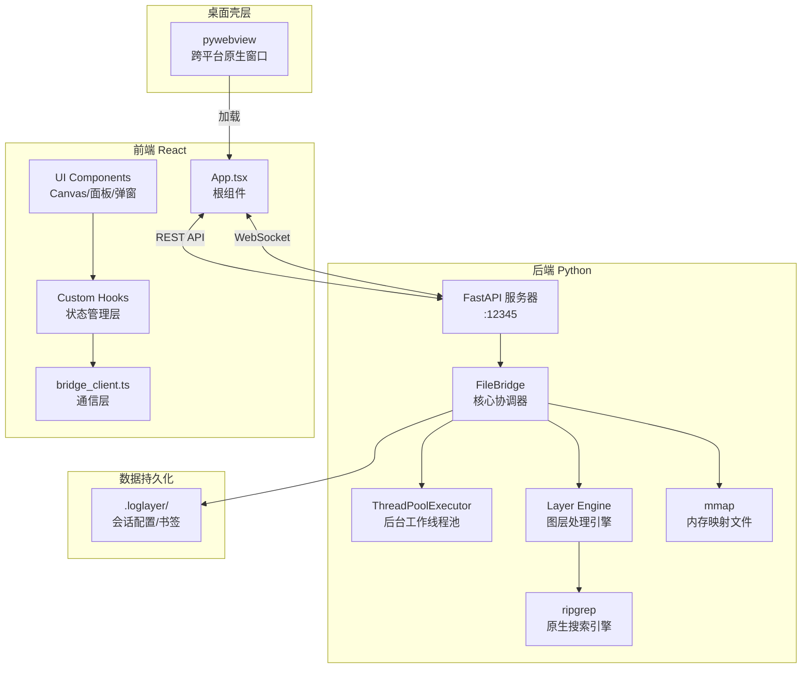

---

## 2. 技术栈分层

### 2.1 技术栈概览

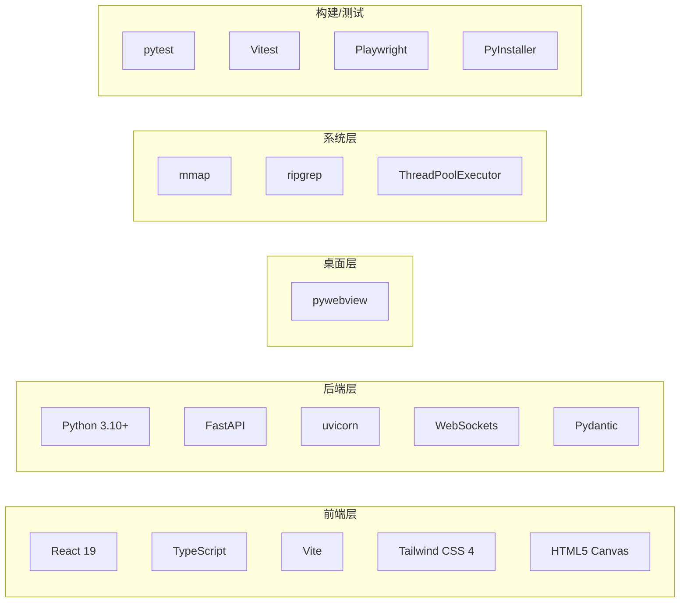

### 2.2 目录结构

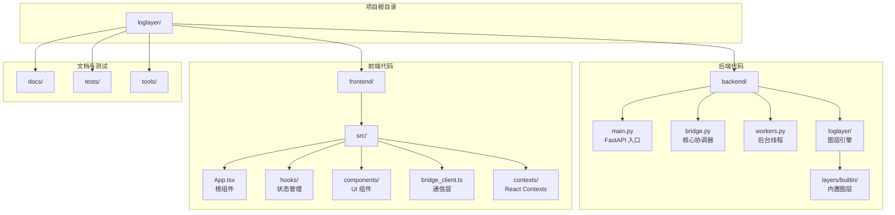

---

## 3. 后端架构

### 3.1 模块依赖关系（重构后）

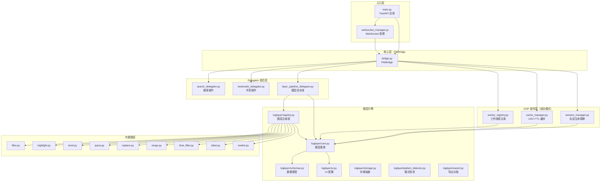

### 3.2 OOP 重构说明

| 重构前（Mixin 继承） | 重构后（组合模式） |
|:---------------------|:-------------------|
| `FileBridge --|> SearchPipeline` | `SearchDelegator` 通过构造函数注入依赖 |
| `FileBridge --|> BookmarkPipeline` | `BookmarkDelegator` 组合到 FileBridge |
| `FileBridge --|> LayerPipelineMixin` | `LayerPipelineDelegator` 负责流水线 |
| 内部状态分散在 FileBridge | 新增 `SessionManager`, `CacheManager`, `WorkerRegistry` |

### 3.3 API 端点分类

```mermaid
graph TB
    subgraph "FastAPI 端点 - main.py"
        API[REST API :12345/api/*]
        WS[WebSocket :12345/ws]
    end
    
    subgraph "文件操作"
        F1[POST /open_file]
        F2[POST /close_file]
        F3[GET /select_files]
        F4[GET /select_folder]
        F5[GET /list_directory]
        F6[GET /file_info]
    end
    
    subgraph "图层/流水线"
        L1[POST /sync_all]
        L2[POST /sync_layers]
        L3[POST /sync_decorations]
        L4[GET /read_processed_lines]
        L5[POST /get_lines_by_indices]
    end
    
    subgraph "搜索操作"
        S1[POST /search_ripgrep]
        S2[GET /get_search_match_index]
        S3[GET /is_search_match]
        S4[GET /get_nearest_search_rank]
        S5[GET /get_next_search_match]
        S6[GET /get_search_matches_range]
    end
    
    subgraph "书签操作"
        B1[POST /toggle_bookmark]
        B2[GET /get_bookmarks]
        B3[GET /get_nearest_bookmark_index]
        B4[POST /clear_bookmarks]
        B5[POST /update_bookmark_comment]
    end
    
    subgraph "工作区"
        W1[POST /save_workspace_config]
        W2[GET /load_workspace_config]
        W3[GET /list_logs_in_folder]
    end
    
    subgraph "分析/导出"
        A1[GET /log_level_stats]
        A2[GET /analyze_log_pattern]
        A3[GET /suggest_layers]
        A4[POST /export_logs]
    end
    
    subgraph "系统"
        SYS1[GET /platform]
        SYS2[GET /has_native_dialogs]
        SYS3[GET /worker_config]
        SYS4[POST /worker_config]
        SYS5[GET /system_metrics]
        SYS6[GET /physical_to_visual_index]
    end
    
    subgraph "插件/挂件"
        P1[GET /get_layer_registry]
        P2[GET /get_ui_widgets]
        P3[GET /get_widget_data]
        P4[POST /reload_plugins]
    end
    
    API --> F1 & F2 & F3 & F4 & F5 & F6
    API --> L1 & L2 & L3 & L4 & L5
    API --> S1 & S2 & S3 & S4 & S5 & S6
    API --> B1 & B2 & B3 & B4 & B5
    API --> W1 & W2 & W3
    API --> A1 & A2 & A3 & A4
    API --> SYS1 & SYS2 & SYS3 & SYS4 & SYS5 & SYS6
    API --> P1 & P2 & P3 & P4
```

### 3.4 FileBridge 核心类（重构后）

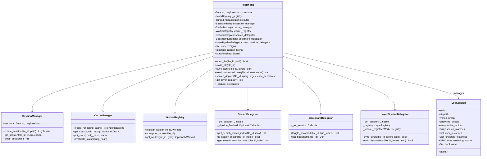

### 3.5 后台工作线程

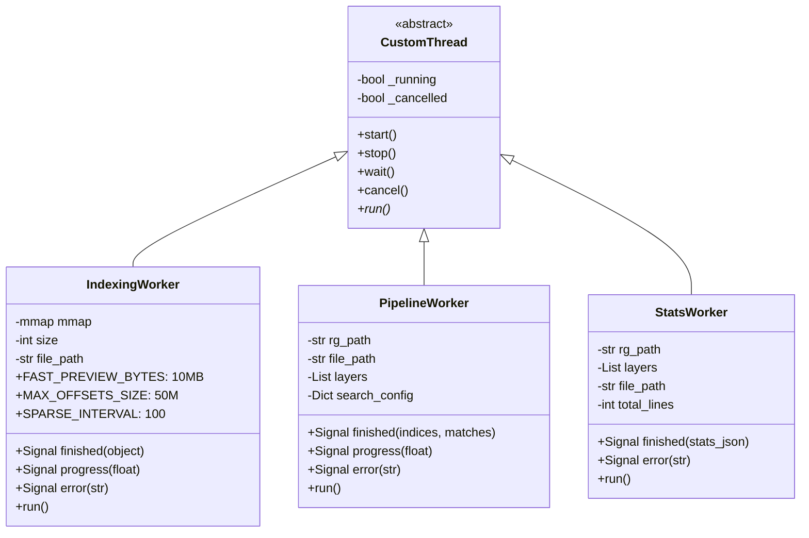

---

## 4. 前端架构

### 4.1 组件层级结构

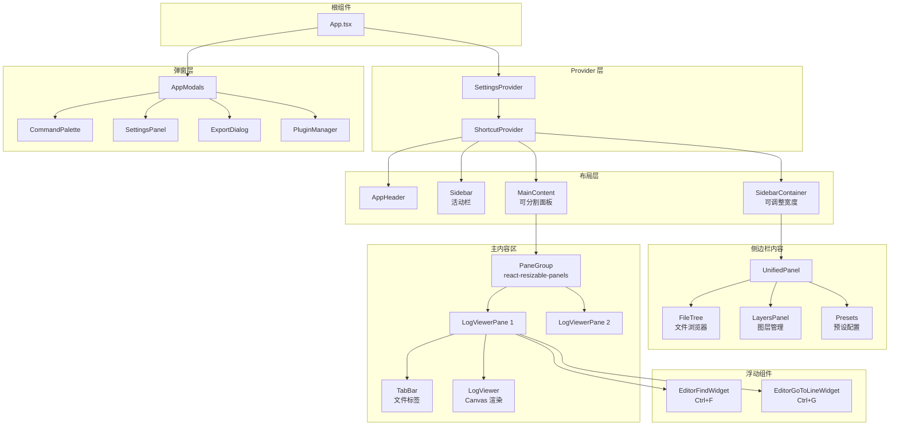

### 4.2 状态管理：Hooks 组合模式

> **注意**: 文档早期版本曾描述 WorkspaceContext Provider，但当前实现使用 **Hooks 组合模式** 替代了 Context Provider。状态通过 `useFileManagement` 和 `usePaneManagement` 管理，通过 props 传递到子组件。

**核心概念**：
- `activeFileId` 是 **Pane（面板）级别** 的属性，不是全局状态
- 每个 Pane 维护自己的 `openFileIds[]` 和 `activeFileId`
- 支持多窗口分割，每个窗口独立跟踪激活文件

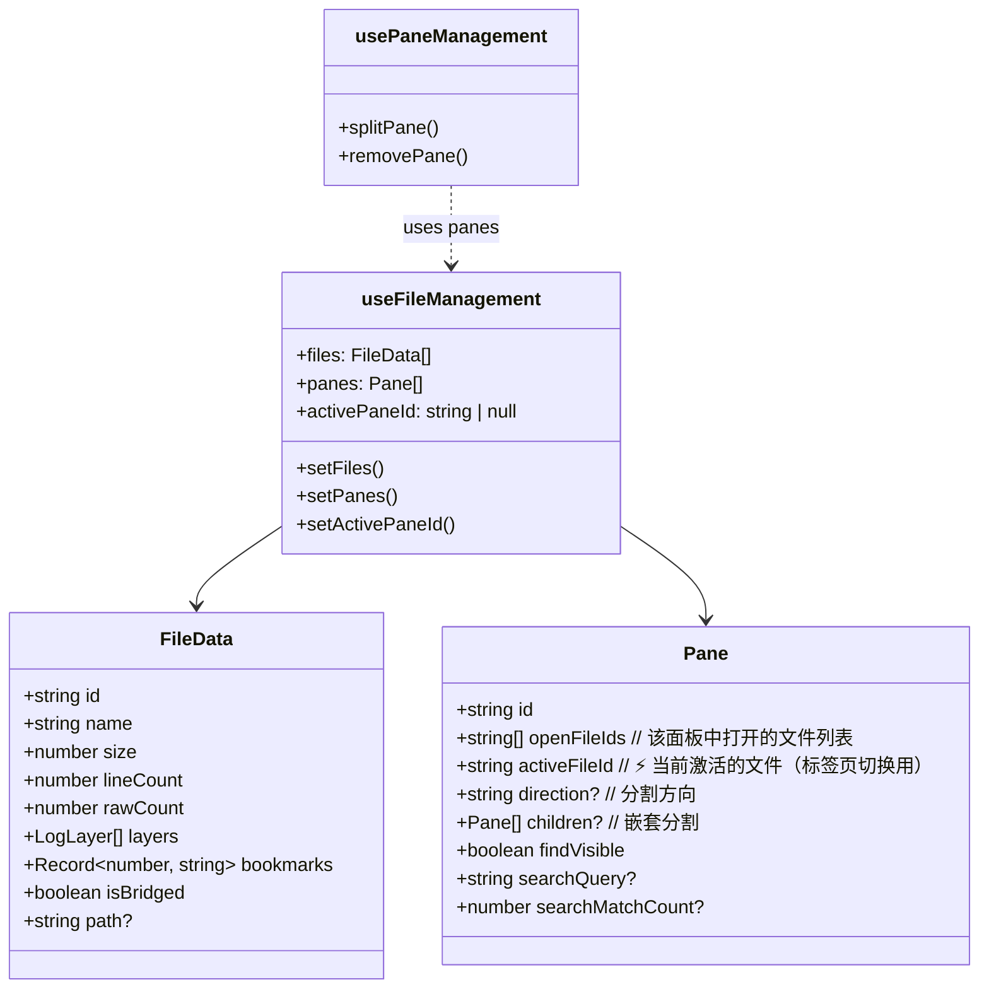

**activeFileId 的作用**：
1. **标签页切换**：用户点击不同标签时，更新当前 Pane 的 `activeFileId`
2. **状态隔离**：搜索、过滤、书签等状态按 `activeFileId` 隔离存储
3. **UI 显示**：状态栏、行号等信息来自当前 `activeFileId` 对应的文件

### 4.3 自定义 Hooks 依赖图

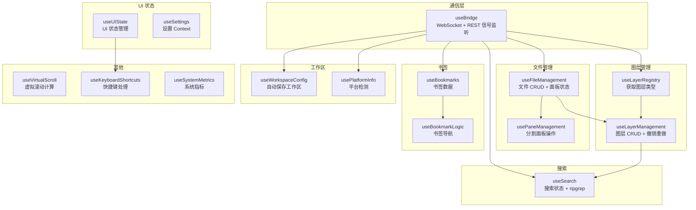

### 4.4 状态管理架构

```mermaid
graph TB
    subgraph "Context Providers"
        SETTINGS_CTX[SettingsContext<br/>21 个设置项]
        SHORTCUT_CTX[ShortcutContext<br/>快捷键映射]
        WORKSPACE_CTX[WorkspaceContext<br/>新增 - 文件/面板状态]
    end
    
    subgraph "文件状态 - useFileManagement"
        FILES_STATE[files: FileData[]<br/>打开的文件列表]
        PANES_STATE[panes: Pane[]<br/>分割面板树]
        ACTIVE_PANE[activePaneId<br/>当前聚焦面板]
        INDEXING[indexingFileIds: Set<br/>加载中文件]
    end
    
    subgraph "图层状态 - useLayerManagement"
        LAYERS_STATE[layers: LogLayer[]<br/>当前文件图层]
        UNDO_REDO[past/future: LogLayer[][]<br/>撤销重做历史]
        PRESETS_STATE[presets: LayerPreset[]<br/>保存的预设]
    end
    
    subgraph "搜索状态 - useSearch"
        QUERY[searchQuery: string]
        CONFIG[searchConfig: {regex, caseSensitive}]
        RANK[currentMatchRank: number]
        HISTORY[searchHistory: string[]]
    end
    
    subgraph "UI 状态 - useUIState"
        VIEW[activeView: main/help]
        WIDTH[sidebarWidth: number]
        SCROLL[scrollToIndex: number?]
        PROCESSING[isProcessing: boolean]
    end
    
    SETTINGS_CTX --> WORKSPACE_CTX
    WORKSPACE_CTX --> FILES_STATE
    FILES_STATE --> LAYERS_STATE
    FILES_STATE --> PANES_STATE
    LAYERS_STATE --> SEARCH
    UI_STATE --> VIEW
```

### 4.5 Bridge Client 通信架构

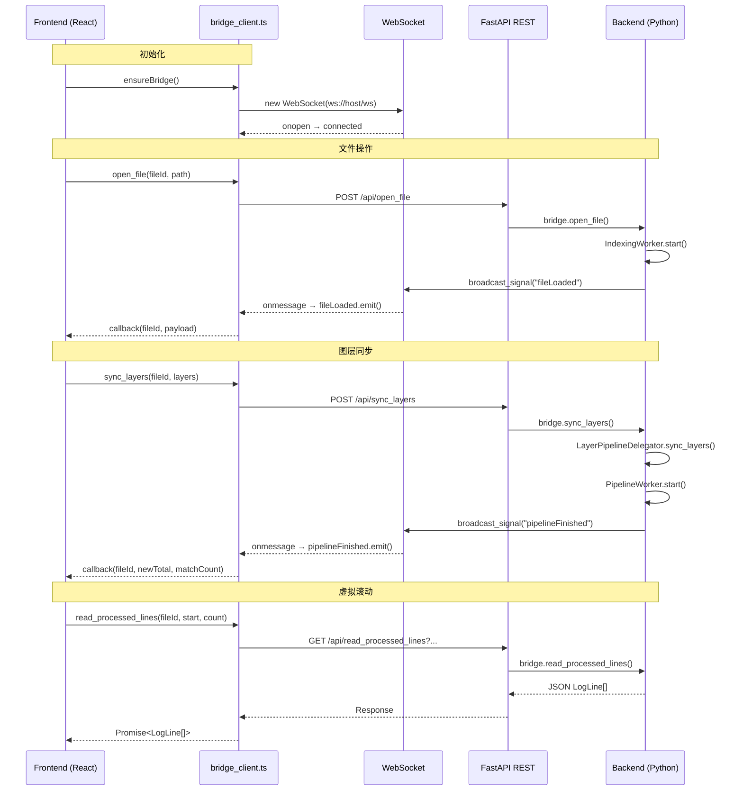

---

## 5. 图层系统核心

### 5.1 图层类继承层次

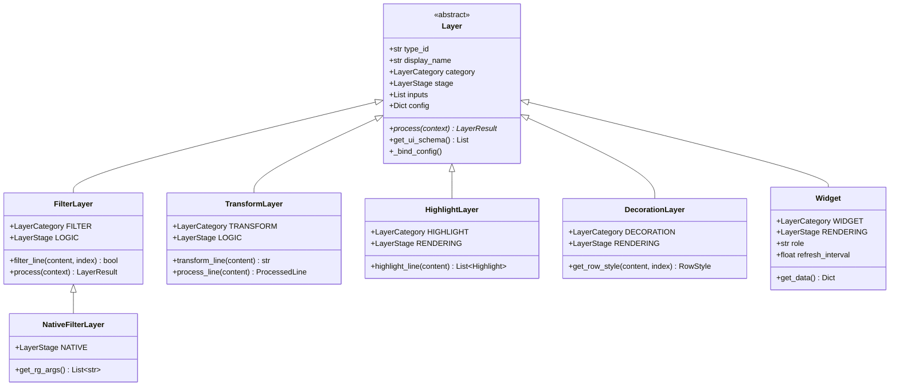

### 5.2 三阶段流水线

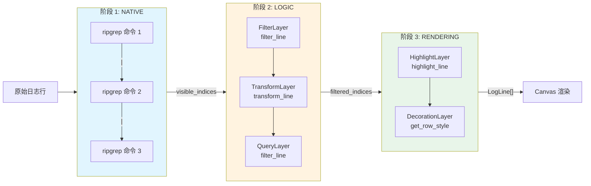

### 5.3 五类别功能分类

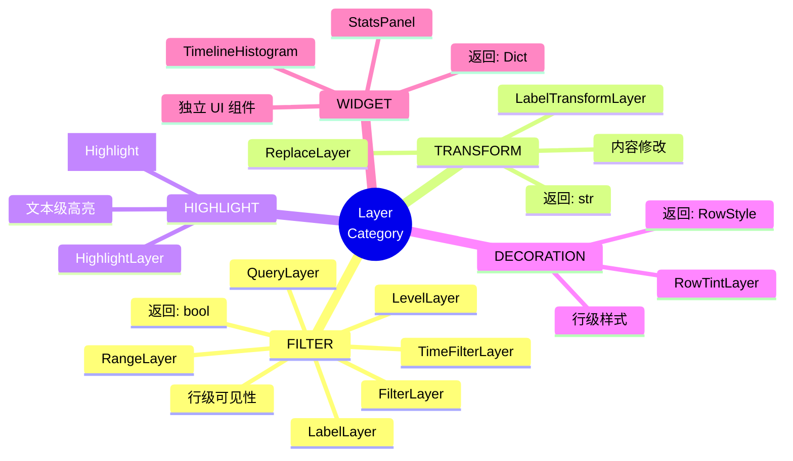

### 5.4 内置图层实现

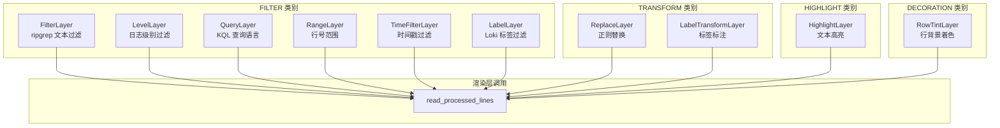

### 5.5 LayerRegistry 注册表

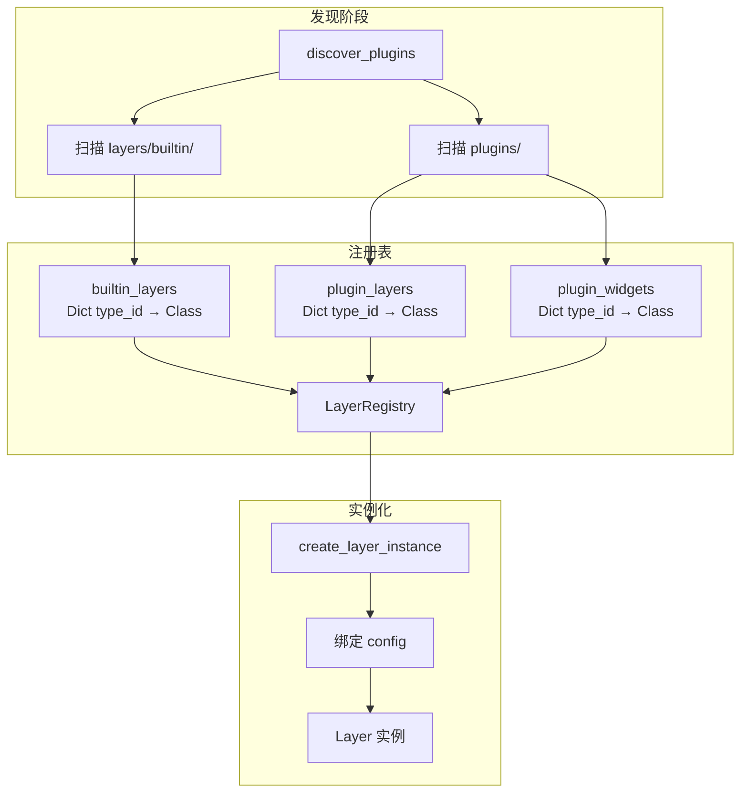

---

## 6. 数据流与交互

### 6.1 文件打开流程

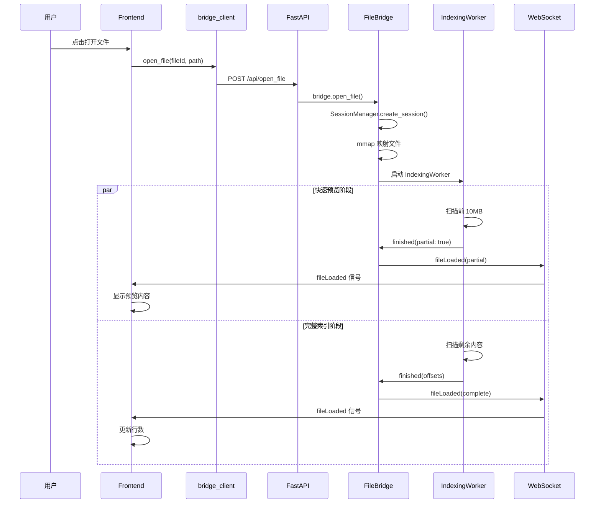

### 6.2 虚拟滚动数据流

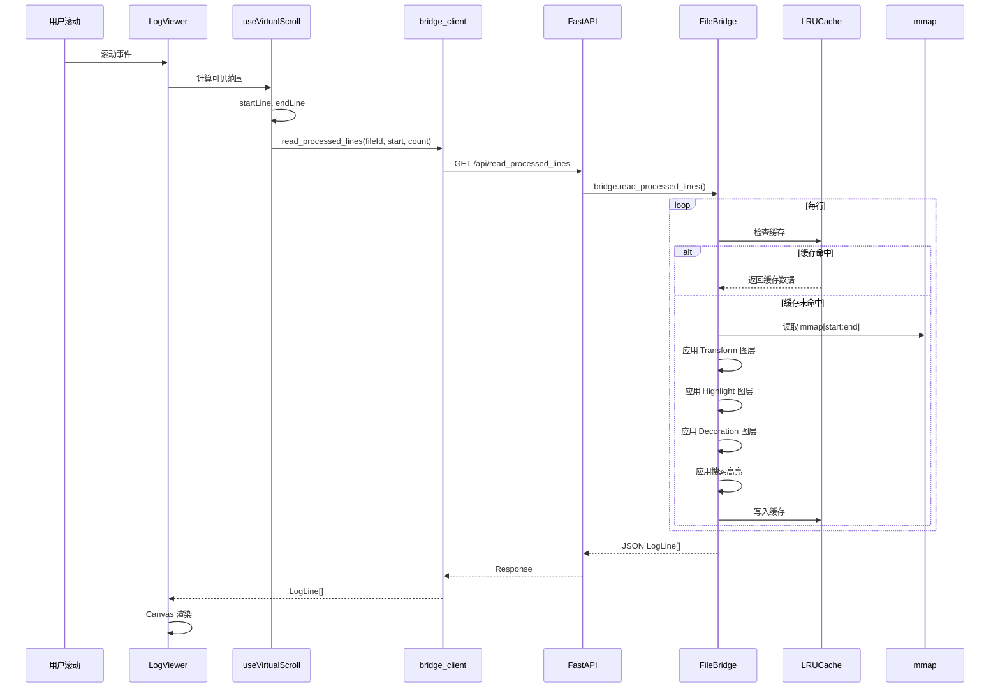

### 6.3 图层同步流程（重构后）

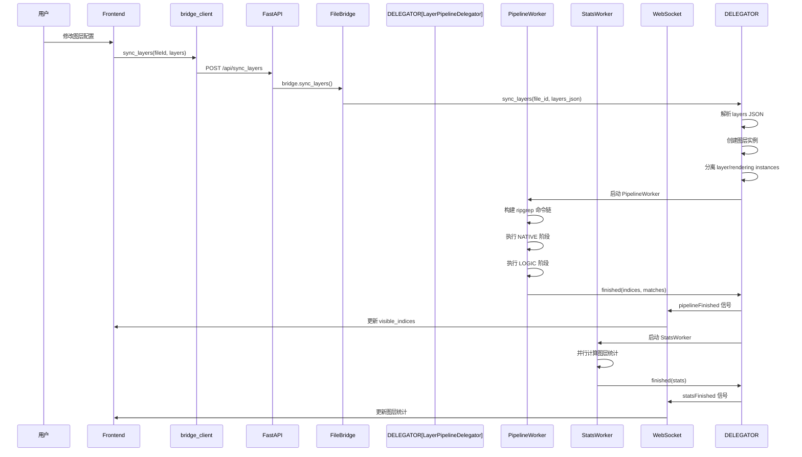

### 6.4 WebSocket 信号流

```mermaid
flowchart LR
    subgraph "Backend Signals"
        S1[fileLoaded]
        S2[pipelineFinished]
        S3[statsFinished]
        S4[operationStarted]
        S5[operationProgress]
        S6[operationError]
        S7[pendingFilesCount]
    end
    
    subgraph "WebSocket"
        WS[WebSocket连接<br/>ws://host/ws]
    end
    
    subgraph "Frontend Signals"
        F1[fileLoaded.emit]
        F2[pipelineFinished.emit]
        F3[statsFinished.emit]
        F4[operationStarted.emit]
        F5[operationProgress.emit]
        F6[operationError.emit]
        F7[pendingFilesCount.emit]
    end
    
    subgraph "Hook Callbacks"
        CB1[useBridge<br/>onFileLoaded]
        CB2[useBridge<br/>onPipelineFinished]
        CB3[useBridge<br/>onStatsFinished]
    end
    
    S1 --> WS --> F1 --> CB1
    S2 --> WS --> F2 --> CB2
    S3 --> WS --> F3 --> CB3
    S4 --> WS --> F4
    S5 --> WS --> F5
    S6 --> WS --> F6
    S7 --> WS --> F7
```

---

## 7. 类型同步机制

### 7.1 前后端类型映射

```mermaid
graph LR
    subgraph "Python Backend"
        P1[schemas.py<br/>Pydantic Models]
        P2[LayerTypeEnum]
        P3[LogLayer]
        P4[LayerConfig]
        P5[LogLine]
        P6[Highlight]
        P7[RowStyle]
    end
    
    subgraph "TypeScript Frontend"
        T1[types.ts<br/>Interfaces]
        T2[LayerType enum]
        T3[LogLayer interface]
        T4[LayerConfig interface]
        T5[LogLine interface]
        T6[Highlight inline]
        T7[RowStyle interface]
    end
    
    P2 <-->|"Mirror"| T2
    P3 <-->|"Mirror"| T3
    P4 <-->|"Mirror"| T4
    P5 <-->|"Mirror"| T5
    P6 <-->|"Mirror"| T6
    P7 <-->|"Mirror"| T7
```

### 7.2 命名约定转换

```mermaid
flowchart TB
    subgraph "Frontend camelCase"
        F1[fileId]
        F2[lineIndex]
        F3[caseSensitive]
        F4[startRank]
        F5[folderPath]
    end
    
    subgraph "bridge_client.ts 转换"
        CONV[自动转换]
    end
    
    subgraph "Backend snake_case"
        B1[file_id]
        B2[line_index]
        B3[case_sensitive]
        B4[start_rank]
        B5[folder_path]
    end
    
    F1 --> CONV --> B1
    F2 --> CONV --> B2
    F3 --> CONV --> B3
    F4 --> CONV --> B4
    F5 --> CONV --> B5
```

### 7.3 核心数据结构

```mermaid
classDiagram
    class LogLayer {
        +string id
        +string name
        +LayerType type
        +boolean enabled
        +boolean isLocked?
        +boolean isCollapsed?
        +string groupId?
        +LayerConfig config
    }
    
    class LayerConfig {
        +string query?
        +boolean regex?
        +boolean caseSensitive?
        +boolean wholeWord?
        +boolean invert?
        +string[] levels?
        +string color?
        +float opacity?
        +... (extra fields)
    }
    
    class LogLine {
        +number index
        +string content
        +string displayContent?
        +Highlight[] highlights?
        +boolean isMarked?
        +string bookmarkComment?
        +RowStyle rowStyle?
    }
    
    class Highlight {
        +number start
        +number end
        +string color
        +float opacity
        +boolean isSearch?
    }
    
    class RowStyle {
        +string backgroundColor?
        +string color?
    }
    
    class FileData {
        +string id
        +string name
        +number size
        +number lineCount
        +number rawCount
        +LogLayer[] layers
        +History history
    }
    
    class Pane {
        +string id
        +string[] openFileIds
        +string activeFileId?
        +string direction?
        +Pane[] children?
    }
    
    LogLayer --> LayerConfig
    LogLine --> Highlight
    LogLine --> RowStyle
    FileData --> LogLayer
```

---

## 8. 模块交互总览

### 8.1 完整系统交互图

```mermaid
flowchart TB
    subgraph "用户界面层"
        UI[React Components]
        HOOKS[Custom Hooks]
    end
    
    subgraph "通信层"
        BRIDGE_CLIENT[bridge_client.ts]
        REST[REST API]
        WS[WebSocket]
    end
    
    subgraph "后端服务层"
        FASTAPI[FastAPI Server]
        FILEBRIDGE[FileBridge]
        REGISTRY[LayerRegistry]
    end
    
    subgraph "OOP 组件层（新增）"
        SESSION_MGR[SessionManager]
        CACHE_MGR[CacheManager]
        WORKER_REG[WorkerRegistry]
    end
    
    subgraph "Delegator 层（新增）"
        SEARCH_DEL[SearchDelegator]
        BOOKMARK_DEL[BookmarkDelegator]
        PIPELINE_DEL[LayerPipelineDelegator]
    end
    
    subgraph "处理引擎层"
        WORKERS[ThreadPoolExecutor]
        INDEXING[IndexingWorker]
        PIPELINE[PipelineWorker]
        STATS[StatsWorker]
    end
    
    subgraph "图层处理层"
        NATIVE[NATIVE Stage<br/>ripgrep]
        LOGIC[LOGIC Stage<br/>Python]
        RENDERING[RENDERING Stage<br/>按需调用]
    end
    
    subgraph "数据访问层"
        MMAP[mmap<br/>内存映射]
        STORAGE[.loglayer/<br/>持久化]
        CACHE[LRUCache<br/>渲染缓存]
    end
    
    UI --> HOOKS
    HOOKS --> BRIDGE_CLIENT
    BRIDGE_CLIENT --> REST
    BRIDGE_CLIENT --> WS
    
    REST --> FASTAPI
    WS --> FASTAPI
    FASTAPI --> FILEBRIDGE
    FILEBRIDGE --> REGISTRY
    FILEBRIDGE --> SESSION_MGR
    FILEBRIDGE --> CACHE_MGR
    FILEBRIDGE --> WORKER_REG
    FILEBRIDGE --> SEARCH_DEL
    FILEBRIDGE --> BOOKMARK_DEL
    FILEBRIDGE --> PIPELINE_DEL
    
    SESSION_MGR --> WORKERS
    WORKER_REG --> WORKERS
    
    WORKERS --> INDEXING
    WORKERS --> PIPELINE
    WORKERS --> STATS
    
    PIPELINE_DEL --> NATIVE
    PIPELINE_DEL --> LOGIC
    FILEBRIDGE --> RENDERING
    
    INDEXING --> MMAP
    PIPELINE --> MMAP
    RENDERING --> MMAP
    RENDERING --> CACHE
    
    FILEBRIDGE --> STORAGE
```

### 8.2 关键设计决策

| 决策 | 选择 | 原因 |
|:-----|:-----|:-----|
| 通信协议 | REST + WebSocket | REST 用于按需数据获取，WebSocket 用于实时信号 |
| 大文件处理 | mmap + 虚拟滚动 | 支持 GB 级文件，O(1) 内存占用 |
| 搜索引擎 | ripgrep | 原生多线程，比 grep 快 10-100 倍 |
| 图层流水线 | 3 阶段分离 | NATIVE 最快，LOGIC 灵活，RENDERING 按需 |
| 状态管理 | 纯 Hooks + Context | 避免 Redux 复杂性，保持代码简洁 |
| 类型同步 | 手动 Mirror 注释 | 灵活可控，适合中小型项目 |
| OOP 重构 | 组合 > 继承 | 消除 Mixin 依赖，更清晰的责任分离 |
| 新增组件 | WorkspaceContext | 统一管理文件/面板状态，避免 prop drilling |

---

## 附录：快速导航

| 想了解... | 请阅读 |
|:----------|:-------|
| 后端 API 端点 | [第 3.3 节](#33-api-端点分类) |
| 前端组件层级 | [第 4.1 节](#41-组件层级结构) |
| OOP 重构说明 | [第 3.2 节](#32-oop-重构说明) |
| 新增 WorkspaceContext | [第 4.2 节](#42-新增workspacecontext) |
| 图层类继承 | [第 5.1 节](#51-图层类继承层次) |
| 三阶段流水线 | [第 5.2 节](#52-三阶段流水线) |
| 文件打开流程 | [第 6.1 节](#61-文件打开流程) |
| 虚拟滚动原理 | [第 6.2 节](#62-虚拟滚动数据流) |
| 类型同步约定 | [第 7.2 节](#72-命名约定转换) |

---

*文档生成时间: 2026-03-28*
*基于 LogLayer 项目 OOP 重构后架构分析*
